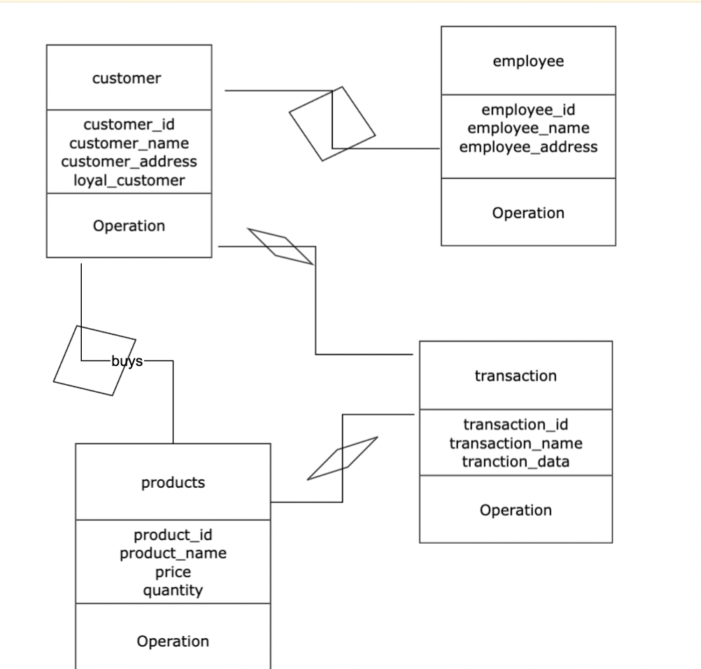

# SQL
query lanaguage (used for big data)
ORCAL DEVELOPERS ARE THE LARGEST DATABASE MANAGEMENT COMPANY
most cloud computing platforms provides MYSQL IN AWS AND AZURE 

**MYsql**
INONDB is a default storage engine for high performance and reliability 

##  Data 
data is a collection of raw facts 
## information 
is a processed data 
##database
collection of processed data and raw facts in large volumne / collection of schema 
## schema 
its a collection of tables 
## DBMS
its a process of storingand retrieving data or information 
  1. *relational database (sql ,tables)*
  2. *hierarchial database (nosql)*
  3. *network (neo-4 j)*
  4. *object oriented *
##ER -diagram 
represenation of entities and attributes , describes relationship btw each other 

**entity**
its a non living or real things where data is maintained / entity conatins the attributes 

**attribute**
property of an entity 
1. key attribute 
2. composite attribute 
3. derived attribute 
4. multivalued attribute 

primary key is unique key and doesnt have null values in the table
foriegn key is a link btw two table 
foriegn key and primary key should have same data type
**Realationship**
it is a process of describe a realationship between enitity 
1. one to one
2. one to many
3. many to one
4. many to many 

**cardinality ratio:**
its a process of expressing the relationship to find out how are participating in the event 
 
The commands available in SQL can be broadly categorised as follows:

**Data Definition Language (DDL):** changing the schema 

1. Create  
- (create database ;)( create table name;)
2. Alter
-  (to change the column rename, add , remove and change the datatyoe in the table)
-  ALTER TABLE NAME ADD COLUMN NAME;
-  ALTER TABLE NAME remove COLUMN NAME;
-  ALTER TABLE NAME MODIFY COLUMN NAME ;- datatype change 
-  ALTER TABLE transaction ADD CONSTRAINT customer_id FOREIGN KEY(customer_id)REFERENCES CUSTOMER(customer_id);
4. Drop 
- drop table test; (which will drope the entire table )
5. Rename
-  RENAME TABLE Old_Table_Name TO New_Table_Name;  (rename the database table )
6. Truncate
- TRUNCATE TABLE Table_Name; ( is used for deleting all the records from the table )

**Data Manipulation Language (DML):** not distrubing the schema 
1. Insert  
- insert into <table name> values(--,--);
2. Update 
- to update is used for changing the exsisting table value
- UPDATE product SET product_address = 'brazil' WHERE product_address = '15';
- update table name set name ='',address='' where zip='89'; null -values
3. Delete  
- delete from table name where name ='';   / delete from table name ;-( delete the entire row values ) 
- DELETE FROM transaction WHERE transaction_id = 5008;
4. Select
- select * from tablename;
- select * from city where country ='india' and states  in ('karnataka','delhi');
- select 5/0 = null not infifnity in mysql
- select concate( 'is', '' ,nidhi')
- select distict(column) from table
- select upper/lower(column)
  
schema
- its a collection of tables 

code for creating database
DDL
```
create database ;
create databse database_name;
create table (id serial,name char(12));
create table table_name
- (column_name datatype key);
* show databases;
use databse;
* show create table customer;
* show tables;
* show table status;
* desc table name;
- to show the column name, type , null values of the table )

alter table by adding column
alter table table_name add column column_name constraint;
alter table by deleting column
alter table table_name drop column column_name;
alter table by changing an existing column and constraint
alter table table_name change old_column_name new_column_name constraint;
ALTER TABLE table_name ADD CONSTRAINT anyname FOREIGN KEY(column_name)REFERENCES table_name(column_name;

drop database
drop database database_name;
drop table
drop table table_name;
```

to use the database after importing the file 
```
show datbases
use world
show tables
```

join clause
ability to join the rows from diffrent tables and find relationship between them.
- track as t-table (column - id forign key , track , titile , duration)
- alblum as a-table (column -id primary key, titile ,artist)
  

```
select a.artist as artist,a.title ,t.title as album,t.title,t.track_number,t.duration
from album as a join track as t on a.id=album_id
order by a.artist,a.title,t.track_number;
```

MODE %
   "%Mon"- which ends with MON string value 
   "mon%"- which start with MON string value
   STRCMP is to compare the string 
   - select name from country
     where strcmp(name,'cuba')>0 order by name;
     (regular expression, for getting last r letter) select name from country
     where rlike r$ order by name;
      where rlike '[xy][ia]'// trying to get eitherr x or y - or i or a

# select comments 
  1. select count(*) from table_name; 
  - ( counting the number of rows in the column)
  2. SELECT * FROM table_name 
  ORDER BY limit 5;
  - (fetch only 5 rows)
  3. insert into column name values( constraints) 
  - (to add a row or rows to the table)
  
  ## Data Types
  - numeric -( decimal- for financial applications,float , double )
  - string
  - data and time ( select now(),year -month -day time)
  - boolean and sets
  
  select fa+fab, da,db from munerics;  o/p (0.33388 , 03)
  
 ## UML-design for database
  - inheritance class -(its a sub class which will be a part of parent class) abstraction 
  - association ( super sub class)
  - aggregation ( without any dependency )
  - composition( with dependency)
  

#trader jo;s buisness idea 
	

	
## Alies
- SELECT (t1.column1, t2.column2)
- update (UPDATE table1 t1)
- JOIN (table2 t2 ON t1.column1 = t2.column1)
- group by ( t1.column , t2.column)
- CASE WHEN t2.column3 = 'X' 
- SET t1.column2 = t1.column2 +

### functions

	1. join   
	2. alies
	3. if ( if movie_title like the% ,  'the movie', null ) as message // message is a new column , (the movie is true , and null is false) - what to print in meassage 
	4. like
	5. between 
	6. case
	7. having 
	8. where 
	9. aggretion function (max, min , count,sum)
	10. distinct 
	11. group by  select to_char(hiring_date),'yyyy') // to_char is used to select specific date
	12. order by 
## sub query 
	single row sub query - when one row selected 
	
	``` 
	select dep no , dep name , salary from dep
	where salary > 
	(select avg(salary)
	from emp);
	```
mutiple sub query 
	this function are used (in , any, all )
      ```
	select dep_id  ,last name
	from employee
	where depart in(
	select dep_id 
	from depar
	where depar in ('finace' ,'sale');
	```
